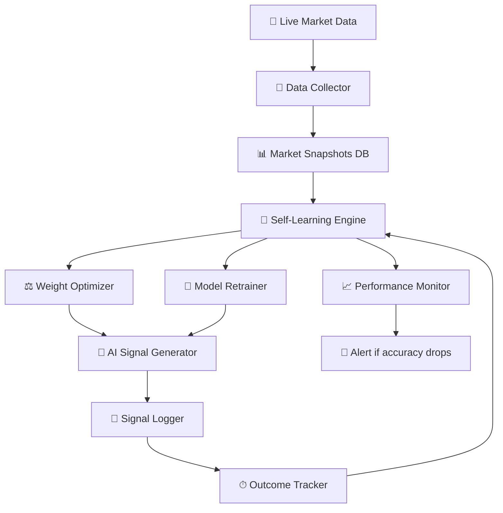

# Self-Learning Trading System — Implementation Plan

The system will automatically train, evaluate, adapt, and upgrade itself by creating a closed feedback loop: **Signal → Outcome → Learn → Improve → Better Signal**.

## Architecture



## How It Works

| Step | What Happens | When |
|------|-------------|------|
| 1. **Log** | Every AI signal is stored with timestamp + market state | Every signal |
| 2. **Track** | After 15/30/60 min, check if prediction was correct | Continuously |
| 3. **Score** | Calculate accuracy per component (Price, Pattern, Sentiment, Options) | Every 30 min |
| 4. **Adapt** | Increase weight of accurate components, decrease bad ones | Every hour |
| 5. **Retrain** | Retrain ML models on accumulated live data | Daily at 3:45 PM |
| 6. **Report** | Log performance metrics, version new models | Daily |

## Proposed Changes

### Self-Learning Engine

#### [NEW] [self_learning_engine.py](file:///home/mohit/Desktop/system%20repair%20by%20antigravity/nifty_options%20(copy%202)/src/utils/ml/self_learning_engine.py)

Core engine with these classes:

**`DataCollector`** — Fetches and stores live 5-min candles every 5 minutes into SQLite
- Stores OHLCV data in `market_snapshots` table
- Maintains rolling 30-day window for training

**`SignalTracker`** — Logs every signal and tracks outcomes
- Records: timestamp, signal, score, confidence, components, nifty_price
- After 15/30/60 min, records actual price movement
- Calculates: was the prediction correct? How accurate was each component?

**`WeightOptimizer`** — Adjusts AI signal weights dynamically
- Tracks Exponential Moving Average (EMA) of accuracy per component
- Components with > 60% accuracy get weight boost
- Components with < 40% accuracy get weight reduction
- Total weights always normalize to 1.0
- Stores weight history for analysis

**`ModelRetrainer`** — Retrains models on accumulated data
- Triggers daily at 3:45 PM (after market hours)
- Trains price_predictor and pattern_classifier on last 30 days data
- Registers new model version via `ModelRegistry`
- Only promotes new model if accuracy > old model

**`SelfLearningEngine`** — Orchestrates everything
- Background thread running during market hours
- Coordinates all components above
- Exposes status via API

---

### Database (Extended)

#### [MODIFY] [db_manager.py](file:///home/mohit/Desktop/system%20repair%20by%20antigravity/nifty_options%20(copy%202)/src/utils/db_manager.py)

4 new tables:

```sql
-- Every signal generated
signal_log (id, timestamp, recommendation, score, confidence,
            price_component, pattern_component, sentiment_component,
            options_component, nifty_price, weights_json)

-- Outcome tracking (filled after 15/30/60 min)
signal_outcomes (id, signal_id, check_after_mins, actual_price,
                 price_change_pct, was_correct, checked_at)

-- Model performance over time
model_performance (id, model_name, version, accuracy, f1_score,
                   samples_used, trained_at)

-- Market snapshots for training
market_snapshots (id, timestamp, open, high, low, close, volume,
                  timeframe)
```

---

### Signal Generator Integration

#### [MODIFY] [signal_generator.py](file:///home/mohit/Desktop/system%20repair%20by%20antigravity/nifty_options%20(copy%202)/src/utils/ml/signal_generator.py)

- Load optimized weights from DB on startup (instead of fixed 0.25 each)
- After generating signal, auto-log it to `signal_log`
- Use retrained models when available via `ModelRegistry`

---

### Flask Server Integration

#### [MODIFY] [app.py](file:///home/mohit/Desktop/system%20repair%20by%20antigravity/nifty_options%20(copy%202)/src/web/app.py)

- Start `SelfLearningEngine` as background thread
- New API endpoints:
  - `GET /api/learning/status` — Current learning stats
  - `GET /api/learning/accuracy` — Signal accuracy history
  - `GET /api/learning/weights` — Current + historical weights

---

### Export & Verification (New)

To support detailed manual verification of generated signals:

#### [MODIFY] [db_manager.py](file:///home/mohit/Desktop/system%20repair%20by%20antigravity/nifty_options%20(copy%202)/src/utils/db_manager.py)
- **`get_detailed_signal_log`**: New method to fetch all columns from `signal_log` for the last N signals.
- **Cleanup**: Remove duplicated class definition at the end of the file.

#### [MODIFY] [app.py](file:///home/mohit/Desktop/system%20repair%20by%20antigravity/nifty_options%20(copy%202)/src/web/app.py)
- **`GET /api/learning/export-signals`**: New endpoint that generates a CSV file of the entire signal history for download.

#### [MODIFY] [ai-signal.html](file:///home/mohit/Desktop/system%20repair%20by%20antigravity/nifty_options%20(copy%202)/frontend/ai-signal.html)
- **Download Button**: Add a "Download Detailed Logs" button to the Signal History or Quick Actions section.

---

### Signal Notifications Enhancement (New)

To ensure signals are seen immediately and prominently:

#### [MODIFY] [app.py](file:///home/mohit/Desktop/system%20repair%20by%20antigravity/nifty_options%20(copy%202)/src/web/app.py)
- **Background Signal Broadcaster**: Add a new thread that generates a signal every 60 seconds (or when major changes occur) and emits it via `socketio` to all connected clients.
- **`emit('new_signal', signal)`**: Broadcasters the latest AI analysis in real-time.

#### [MODIFY] [ai-signal.html](file:///home/mohit/Desktop/system%20repair%20by%20antigravity/nifty_options%20(copy%202)/frontend/ai-signal.html)
- **Socket Listener**: Add `socket.on('new_signal')` to handle incoming real-time signals.
- **Enhanced Toast UI**: Improve `showNotification` with better animations, icons, and color logic (e.g., green for all BUY variants, red for SELL).
- **Desktop Notifications**: Implement `Notification.requestPermission()` and show native browser notifications if the tab is hidden.
- **Sound Alerts**: Ensure sound alerts trigger correctly and are audible.

- **Sound Alerts**: Ensure sound alerts trigger correctly and are audible.

---

### Phase 3: Visibility & Trust (New)

To solve the "invisible logic" problem and build user confidence:

#### [MODIFY] [ai-signal.html](file:///home/mohit/Desktop/system%20repair%20by%20antigravity/nifty_options%20(copy%202)/frontend/ai-signal.html)
- **Live AI Logic Stream**: Add a scrolling terminal-style log box that displays real-time "thoughts" from the AI (e.g., "Checking RSI levels...", "Volume spike detected").
- **AI Confidence Gauge**: Replace the percentage text with a high-end, dynamic SVG gauge/speedometer.
- **Logic Heartbeat**: Small glowing pulse next to the "AI Signal" header that flashes every time a new calculation is performed.
- **Improved Chart Annotations**: Show where on the chart the last signal was generated.

#### [MODIFY] [app.py](file:///home/mohit/Desktop/system%20repair%20by%20antigravity/nifty_options%20(copy%202)/src/web/app.py)
- **Logic Step Broadcaster**: Update the signal generator to return a list of "Logic Steps" taken, which the backend will broadcast to the frontend.

---

### Phase 4: Enhanced Price Analytics (New)

To show the price change from the opening price:

#### [MODIFY] [market_data.py](file:///home/mohit/Desktop/system%20repair%20by%20antigravity/nifty_options%20(copy%202)/src/utils/market_data.py)
- **`get_day_open`**: Add method to fetch the opening price for a given symbol today.

#### [MODIFY] [app.py](file:///home/mohit/Desktop/system%20repair%20by%20antigravity/nifty_options%20(copy%202)/src/web/app.py)
- **`background_price_stream`**: Fetch day_open at startup and include it in `price_update` WebSocket event.

#### [MODIFY] [ai-signal.html](file:///home/mohit/Desktop/system%20repair%20by%20antigravity/nifty_options%20(copy%202)/frontend/ai-signal.html)
- **Change Display**: Add a widget next to the Nifty price showing `+120.50 (+0.45%)` or `-50.20 (-0.21%)` relative to the open.

---

### Phase 5: Futures Expansion (New)

To support Futures trading alongside Options:

#### [MODIFY] [app.py](file:///home/mohit/Desktop/system%20repair%20by%20antigravity/nifty_options%20(copy%202)/src/web/app.py)
- **Futures Tracking**: Add Nifty Futures price fetching in the background stream.
- **Spread Analysis**: Calculate "Basis" (Future - Spot) and broadcast it.

#### [MODIFY] [ai-signal.html](file:///home/mohit/Desktop/system%20repair%20by%20antigravity/nifty_options%20(copy%202)/frontend/ai-signal.html)
- **Futures Widget**: Add a small card showing Current Month Futures price and OI change.

---

### Phase 6: Advanced Excellence (via OpenCode CLI)

To make the system unique, we use `opencode` to implement global correlations:

#### [NEW] [global_data.py](file:///home/mohit/Desktop/system%20repair%20by%20antigravity/nifty_options%20(copy%202)/src/utils/global_data.py)
- **`GlobalMarketTracker`**: A new class to fetch GIFT Nifty (SGX) and US Market (S&P 500, Nasdaq) futures data.

#### [MODIFY] [app.py](file:///home/mohit/Desktop/system%20repair%20by%20antigravity/nifty_options%20(copy%202)/src/web/app.py)
- **Global Integration**: Incorporate `GlobalMarketTracker` into the background stream.

#### [MODIFY] [ai-signal.html](file:///home/mohit/Desktop/system%20repair%20by%20antigravity/nifty_options%20(copy%202)/frontend/ai-signal.html)
- **Global Widget**: Add a "Global Sentiment" panel in the header showing GIFT Nifty status and US Market futures.

---

## Verification Plan

### Automated Tests
- Start server, generate signals, wait for outcome tracking
- Verify weights update after enough signals logged
- Verify model retrain triggers correctly

### Manual Verification
- Check `/api/learning/status` after 30 min of running
- Verify accuracy improves after weight optimization cycle
