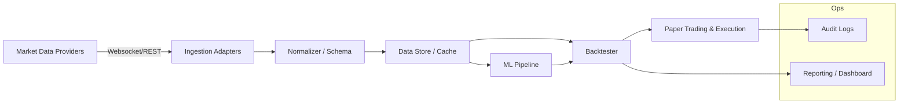
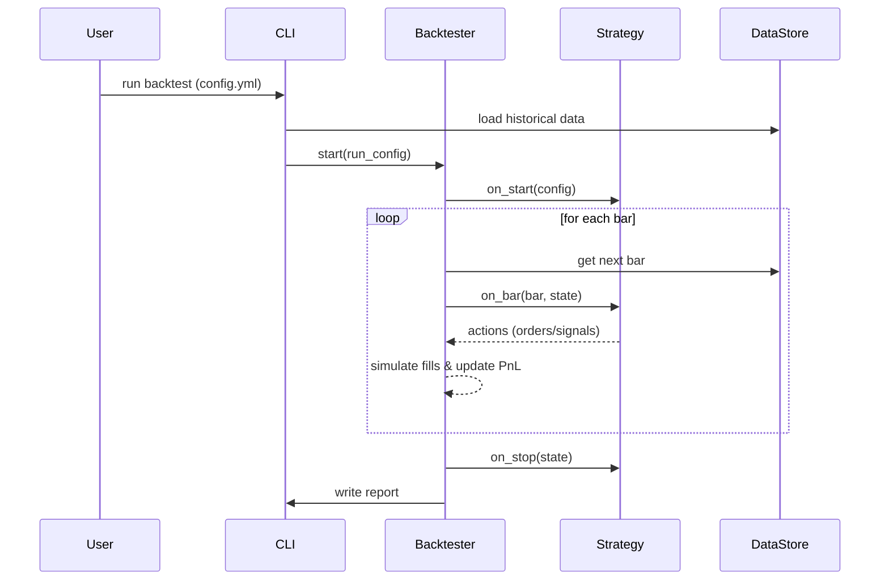

Project: Nifty Options Trading Toolkit — Product Requirements Document (PRD)

Version: 0.1
Author: Team
Last Updated: 2026-03-02

Purpose
-------
This PRD describes the product vision, scope, and detailed requirements for the Nifty Options Trading Toolkit. The product helps quant researchers, algo traders, and developers to build, backtest, and run algorithmic strategies (including options) for the NIFTY index, with optional ML/AI signal integration.

Scope
-----
- Ingest live market data (SmartAPI and REST/websocket adapters)
- Backtesting engine with realistic execution model
- Pluggable strategy API and parameter optimisation
- ML/AI pipelines for feature engineering and signal generation
- Paper trading and basic live execution adapters
- Observability (logging, metrics, basic dashboard)

Target Users
------------
- Quant researchers who build and evaluate strategies
- Developers integrating strategies into execution systems
- Analysts who review backtest results and generate reports

Key Capabilities (Detailed)
---------------------------
1. Live Data Ingestion
   - Adapter pattern to support multiple data providers (SmartAPI, CSV, Parquet, DB).
   - Websocket client with automatic reconnect, jittered backoff, and message deduplication.
   - Normalised internal schema: timestamp (ISO), symbol, open, high, low, close, volume, tick_type.
   - Rate‑limit awareness and graceful degradation if provider throttles.

2. Historical Data Engine
   - Load from CSV/Parquet and local database (SQLite/Postgres) backends.
   - Resampling utilities (tick-to-minute, minute-to-hour, day) with options for OHLC aggregation rules.
   - Caching layer to avoid repeated parsing of large files.
   - Reproducible synthetic generator supporting seeds and event injection (gaps, spikes).

3. Strategy Interface
   - Minimal API for strategies: lifecycle hooks `on_start(config)`, `on_bar(bar, state)`, `on_order_update(ord)`, `on_stop()`.
   - State object persisted between calls for strategy bookkeeping.
   - Support for vectorised batch backtesting and event-driven simulation.

4. Backtesting Engine
   - Support for realistic trade simulation: per-trade commission, slippage models, partial fills, order types (market/limit).
   - Margin model for options and futures (basic: margin percent, assignment rules).
   - Portfolio position sizing strategies (fixed, percent of equity, volatility targeting).
   - Walk‑forward testing and grid/random parameter search tools.

5. ML/AI Pipeline
   - Feature extraction modules (technical indicators, rolling stats, sentiment features).
   - Model training and evaluation modules (train/validation/test splits, cross-validation, logging metrics).
   - Model registry (simple filesystem or DB) with metadata (hyperparameters, seed, performance metrics).
   - Inference wrapper to produce normalized signals consumable by strategies.

6. Paper Trading & Execution
   - Deterministic paper trade engine preserving order lifecycle and latency simulation.
   - Adapter to place real orders via SmartAPI with retry logic and idempotency.
   - Detailed audit logs for all orders and fills.

7. Observability & Ops
   - Structured logging JSON format, and log rotation.
   - Basic metrics exporter (Prometheus compatible) for latencies, queue sizes, backtest durations.
   - Health endpoints for services and simple dashboard templates (optional Flask/Streamlit).

Non-functional Requirements
---------------------------
- Performance: backtests for multi-year daily data should complete within reasonable time (configurable worker pool).
- Reliability: adapters must reconnect and persist minimal state to recover from restarts.
- Security: no credentials in repo; logs must mask secrets.
- Testability: core modules have unit tests; integration tests may use recorded fixtures.
- Maintainability: consistent code style, type hints, and documentation.

Acceptance Criteria
-------------------
- CLI: run a backtest with `config.yml` and output JSON report.
- Adapter: SmartAPI adapter reconnects and resumes within 30s after transient failure.
- ML Pipeline: can train a sample model and produce a saved artifact with metrics logged.
- CI: automated tests run and linting enforced on PRs.

Milestones & Roadmap
--------------------
M1 (0–2 weeks): Project hygiene — README, PRD, requirements, basic backtester demo.
M2 (2–6 weeks): Data ingestion adapters, historical engine, and canonical schema.
M3 (6–12 weeks): Strategy API, advanced backtesting (slippage/margin), and example strategies.
M4 (12–20 weeks): ML pipeline, model registry, paper trading adapter, and dashboard.
M5 (20+ weeks): Production hardening, containerization, and CI/CD pipelines.

Security Considerations
-----------------------
- Keep API keys in environment variables or secret stores.
- Rotate keys and avoid committing them.
- Ensure any uploaded datasets are sanitized. Log redaction for PII and credentials.

Operational Runbooks
--------------------
- How to run a backtest locally.
- How to start the websocket ingestion service.
- How to run model training and register artifacts.
- How to deploy the service via Docker (basic steps).

KPIs (Examples)
----------------
- Backtest run time (median & p95)
- Test coverage %
- Number of successful live (paper) trades per day
- MTTR (mean time to recovery) for data adapter failures

Appendix: API Contracts
-----------------------
- Data event JSON schema example
- Strategy hook signatures
- Backtest result JSON fields

(Expand sections above with diagrams and exact JSON schemas as the project progresses.)

Appendix: JSON Schemas
----------------------

1) Data event (normalized tick/minute)

```json
{
   "$schema": "http://json-schema.org/draft-07/schema#",
   "title": "MarketDataEvent",
   "type": "object",
   "required": ["timestamp","symbol","open","high","low","close","volume"],
   "properties": {
      "timestamp": {"type":"string","format":"date-time"},
      "symbol": {"type":"string"},
      "exchange": {"type":"string"},
      "open": {"type":"number"},
      "high": {"type":"number"},
      "low": {"type":"number"},
      "close": {"type":"number"},
      "volume": {"type":"integer"},
      "tick_type": {"type":"string","enum":["trade","quote","other"]},
      "meta": {"type":"object"}
   }
}
```

2) Backtest result

```json
{
   "$schema":"http://json-schema.org/draft-07/schema#",
   "title":"BacktestReport",
   "type":"object",
   "required":["initial_capital","final_capital","equity_curve","trades"],
   "properties":{
      "initial_capital":{"type":"number"},
      "final_capital":{"type":"number"},
      "total_pnl":{"type":"number"},
      "returns_percent":{"type":"number"},
      "total_trades":{"type":"integer"},
      "winning_trades":{"type":"integer"},
      "losing_trades":{"type":"integer"},
      "win_rate":{"type":"number"},
      "max_drawdown":{"type":"number"},
      "sharpe_ratio":{"type":"number"},
      "equity_curve":{"type":"array","items":{"type":"object","properties":{"date":{"type":"string","format":"date-time"},"equity":{"type":"number"},"capital":{"type":"number"}}}},
      "trades":{"type":"array","items":{"type":"object"}}
   }
}
```

3) Strategy hook signature (informal schema)

```json
{
   "on_start": "fn(config: object) -> state: object",
   "on_bar": "fn(bar: MarketDataEvent, state: object) -> actions: [Order|Signal], state: object",
   "on_order_update": "fn(order_update: object, state: object) -> state: object",
   "on_stop": "fn(state: object) -> void"
}
```

Diagrams
--------

1) Architecture diagram (Mermaid)



2) Backtest sequence (Mermaid sequenceDiagram)



Include these JSON schemas and diagrams in automated docs generation as the project matures.
